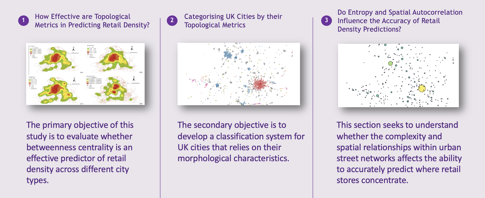

# Assessing the Effectiveness of Topological Metrics for Predicting Retail Density and Categorising UK Cities

This repository contains the code used to study the effectivess of topological street network metrics to categorise and predict economic activity in UK cities

## Abstract
This dissertation investigates the relationship between urban street network topology and retail density in UK cities. This study intends to advance our understanding of how urban form influences retail success. This research develops a typology of UK cities based on their morphological characteristics and secondly evaluates the predictive power of centrality measures in determining retail density. The research reveals that while centrality metrics are useful, they are not universally applicable predictors of retail density due to the varying urban contexts across different city categories. By integrating additional factors such as spatial autocorrelation and street network entropy, this study provides a comprehensive framework that captures the complexity of urban retail environments. The findings underscore the importance of considering a range of topological metrics to better understand and plan for the spatial dynamics of retail distribution. This study is both ambitious and one of the first of its kind in its comprehensive evaluation of urban street networks and retail densities across an entire country (UK). By leveraging modern programming libraries, this research conducts large-scale, detailed analysis that was previously unfeasible.
